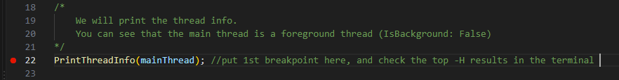
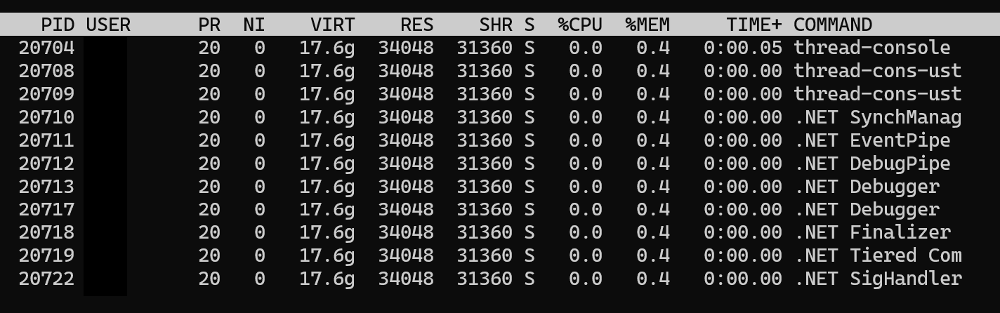
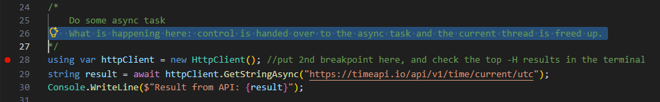
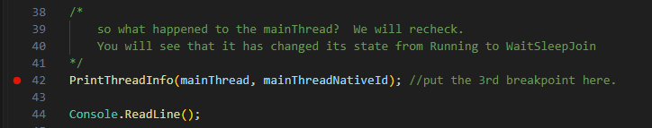
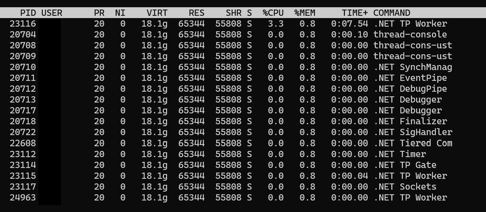
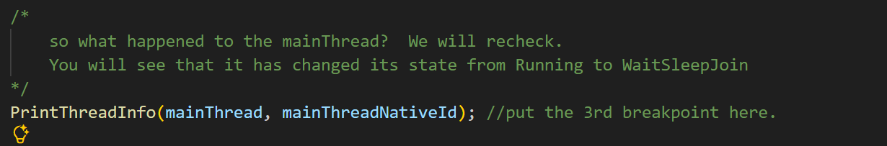

# A Native Look at .NET Thread Pool in Linux

## Introduction
Threading, async programming, and thread pool in .NET are complex topics. You will come across many concepts and technical terms when you engage in any discussion involving threading. A few of such terms are _managed thread, OS thread, thread-pool thread, foreground thread, background thread_ - just to name a few.  While many of us may have a good understanding of these concepts from reading about them, we may not have seen them in action at different layers of abstraction.  Microsoft documentation on .NET threading and related features such as ```ThreadPool```, ```Task``` and ```async/await``` is already very good. However, you will notice that several of those concepts are covered from a Windows perspective.  Some of the examples are _COM, IO Completion Ports (IOCP), Single-Threaded Apartments (STA), Multi-Threaded Apartments (MTA)_, etc. If you look at the [.NET runtime source code on Github](https://github.com/dotnet/runtime), you will see that the implementation of certain threading features is different on Unix-based OSes (eg. Ubuntu, Debian) than on Windows.  While researching on those concepts online is always an option, seeing them in action through hands-on exercises gives us a better picture and more indelible mental model. This article is an attempt to look at some of the core concepts of .NET threading, with emphasis on the thread pool, in a practical way, on Linux. Everything discussed here is based on my reading of books about Linux OS internals (e.g. [The Linux Programming Interface](https://man7.org/tlpi/)), Microsoft documentation of [.NET advanced programming](https://learn.microsoft.com/en-us/dotnet/navigate/advanced-programming/), looking at the [.NET runtime source code on GitHub](https://github.com/dotnet/runtime), as well as practical observation.      

## Scope of the Exercise
.NET can build a variety of applications such as Desktop, Console, Web, etc. The default threading behavior on each of those is different.  It is virtually impossible to cover all the scenarios in an article like this.  Therefore, we will focus mostly on a Console Application project to discuss a few core introductory concepts.  We will carry out our experiments on Ubuntu 24.04.3 LTS, but we will try to discuss some Windows concepts as appropriate.  Finally, all experiments are based on .NET 10, not classic .NET Framework.       

## A Primer on Linux OS Architecture
Before we dive into the hands-on portion, we will first need to cover a few essential Linux OS concepts. This will provide the foundation needed to better understand the hands-on exercise and see how those concepts apply in practice.

### Kernel
The heart of a Linux OS is its kernel, just as it is in Windows. In its purest sense, kernel _is_ the OS. When you turn on your Linux computer, after the initial firmware/bootloader execution, the first piece of software loaded from disk into memory (RAM) is the kernel file (for example /boot/vmlinuz-6.12.47 on certain Debian distros). Kernel acts as the manager of your computer, doing a number of things including functions such as process scheduling, meaning your application's code gets an equitable chance, among other running applications on the system, to execute its code on a CPU; memory management, meaning applications are provided with enough space to store their code and data in the memory so that CPU can fetch and execute them; hardware management, meaning providing your application access to devices such as disks, keyboard, mouse, WiFi/network adapters, etc.   

### Applications and Processes
After kernel is loaded, applications can be started as needed. An application is also known as a _program_ such as one we create using .NET. We will use the term _program_ for rest of our discussion here. A running instance of a program is called a _Process_, even though we often use those terms interchangeably.  For example, when you start 2 instances of your .NET program, you have 2 processes running on the system, one not necessarily aware of the existence of the other.

### Threads
Even though process is the running instance of a program, the actual entity that executes your program's code is a _thread_. Every process has at least one thread, which is created when the process is created (i.e., when a program is started). The initial thread is commonly called the _main thread_. (.NET calls it the _primary thread_).  In the context of our discussion, all threads .NET runtime (CoreCLR) asks Linux kernel to create are [_POSIX threads_](https://en.wikipedia.org/wiki/Pthreads), aka _pthreads_.

### Kernel Scheduler
Now that we understand what the threads are (they are Linux kernel objects!), we need to learn how they execute. Do all threads of all processes run at the same time?  Answer is No.

Since there exists numerous processes on a typical running system, but the system resources may be limited (e.g., only 4 to 8 CPUs and 16GB RAM), kernel uses a scheduling mechanism. An oversimplified way to illustrate the behavior of the scheduler is that it pulls a thread from the execution queue, gives it a chance to run its code on a CPU, suspends it, places it back in line, and immediately grabs the next waiting thread. A CPU can execute only one thread at a time, which means on a computer with 4 CPU cores, the true parallel threads being executed is just 4!

### User Space v/s Kernel Space
All your desktop programs (_process_, more precisely), terminal, etc., run on what is called the _user space_. Whenever a user-space process needs to access the underlying system resources such as the disk, USB devices, WiFi, kernel objects, etc., the user-space process makes a request to the kernel, and those functions are handled by the kernel. A .NET process, whether it is a web API or a Console Application, is also a user-space process.  Therefore, when it needs to access system resources, it ultimately communicates with the operating system through the same mechanisms. 

The same principles apply to threading. When a .NET application needs to create a thread, which is a kernel object, the .NET runtime ultimately relies on the kernel to create and manage the underlying execution thread. On Linux, the .NET runtime makes the appropriate system calls (aka _syscall_), and the Linux kernel creates the corresponding OS-level thread - a _pthread_. Once the thread is created, the .NET runtime can schedule work to run on that thread, but the actual scheduling of the thread onto a CPU is performed by the Linux kernel's scheduler.

### .NET Thread
We saw above that every Linux process has at least one thread called _main thread_. 

.NET main thread is a foreground thread, meaning it the thread that keep the process alive. By default, at the start of the process, there is one foreground thread, but you can create additional foreground threads. You can also create background threads, meaning they are not responsible for keeping the process alive, but you can use them to execute different tasks as needed (e.g., in ASP.NET, the threads used for request handling). However, you need at least one foreground thread to keep the process alive. When all foreground threads exit, the .NET process also exits, even if other background threads are running in the process at that time and consuming resources.

**Note:** The _foreground_ and _background_ are .NET concepts. At the OS level, all those threads are just standard pthreads.

### STA Thread and MTA Thread
Strictly speaking, these are not .NET concepts, rather Windows concepts.  This is one area where Microsoft official documentation, in my opinion, is not perfect, i.e., the documentation does not mention they are not applicable to Linux. In Windows applications, desktop applications use a single-threaded apartment (STA) as the main thread. What this practically means is that STA threads are able to receive window messages such as mouse clicks, key events, etc. A multi-threaded apartment (MTA) thread is a regular thread. In Linux, you don't have to worry about these concepts. However, as a mental model, it is not entirely wrong to think of Linux pthreads as MTA threads. 

### .NET Thread Pool
Just as the kernel understands that the system resources are limited and therefore uses a scheduling mechanism, .NET runtime (CoreCLR) also has a mechanism to manage the threads efficiently at its own level. The mechanism is called the _Thread Pool_, which is a collection of threads CoreCLR maintains. We will see how it works:

At the start of the .NET program, typically there is only the main thread. As needed, you can ask the thread pool to queue additional work items. The crude way to do this is to use ```ThreadPool.QueueUserWorkItem```method, to which you can pass a callback method representing the work you need to perform. The thread pool maintains a Work Queue internally. Your method is added to the work queue. As soon as it finds a waiting work item in the queue, it checks if a free thread is already available to execute the work. Upon finding that no free threads are available, CoreCLR makes a syscall to the kernel to create a pthread. From that point onwards, CoreCLR keeps a 1:1 mapping between the .NET thread object (the managed thread) and the kernel-level pthread (OS thread). The actual work is executed on the pthread.

Even though, .NET offers ```ThreadPool.QueueUserWorkItem```, it is best to avoid using it directly. Instead, the recommended way is to use ```Task``` and ```async/await``` pattern, which provides a consistent programming model for asynchronous programming in general. The specifics are out of scope for this article. However, it is worth noting that Tasks use ThreadPool for execution, and tasks are queued using ```ThreadPool.QueueUserWorkItem``` behind the scenes.

All thread-pool threads are background threads, meaning they are not responsible for keeping the application alive. .NET keeps 2 categories of the thread-pool threads: 
-  **Worker threads:** These are background threads that can be used for any generic processing (eg. ASP.NET request processing). The core idea is that they should ideally be used for short-lived work and released back to the thread pool as soon as possible.  
- **Completion Port threads:** These are background threads used for handling asynchronous input/output (I/O) operations. A typical example is when you use ```async/await``` against a database call or an external API call, completion-port threads are used to get the notification back when result is ready. 

Completion ports is another area Microsoft documentation is incomplete, so this deserves a bit of discussion.  The name IO Completion Port (IOCP) comes from the Windows kernel.  In Windows, when a thread initiates a slow network or disk operation, it does not sit there waiting. It hands the job to the hardware and tells the OS kernel something like: _"When this hardware finishes, post a notice to this specific Completion Port."_

Even though .NET uses the same term on Linux as well, the actual implementation is completely different. Linux does not have IOCP. It instead uses [_epoll_](https://en.wikipedia.org/wiki/Epoll), which is kernel-level I/O event monitoring/notification mechanism. 

For example, when you make an async API call, it goes through the kernel because you need to connect to the API server over a socket.  Kernel establishes the connection and returns a file descriptor, which is an identifier for the socket connection.  Note that, in Linux, conceptually, almost everything is a file including actual file on the disk, network device, the terminal, etc. When you open a file, you get a file descriptor, which you can use to perform operations against it. On a separate monitoring thread (which .NET names as ".NET Sockets" thread), .NET uses an epoll instance to monitor the file descriptors. When an async socket operation cannot complete immediately, .NET registers the file descriptor with epoll so that the kernel can notify .NET when the socket becomes ready. If you are executing your API call using ```async/await``` pattern, while you are awaiting the response from the API server, your current thread is freed up (for a thread-pool thread, it means the thread is returned to the thread pool). When the ".NET Sockets" thread receives notification from epoll (i.e., data is available), it schedules the appropriate socket work to the thread pool. The thread pool retrieves an available thread from the thread pool and executes the continuation. 

**Note:** Technically both worker threads and completion port threads are the same, but .NET keeps a logical separation between worker threads for doing the worker tasks and the completion-port threads to handle async I/O.      

## The Hands-On Look
Now that we have covered enough theory, we can get into the hands-on exercise demonstrating these concepts in action.  

You can see the original project files under the GitHub Repo here. Here is the full listing of the Program.cs class. We will go through it step by step. Note that we have imported 2 native functions from the Linux _libc_ library, which helps us analyze the kernel threads created during the execution.


```csharp
using System.Runtime.InteropServices;

[DllImport("libc.so.6", EntryPoint = "getpid")]
static extern int GetNativeProcessId();

[DllImport("libc.so.6", EntryPoint = "gettid")]
static extern int GetNativeThreadId();

//Lets print the current system info:
PrintSytemProcessAndThreadPoolInfo();

//save the current thread reference so we can check later.
var mainThread = Thread.CurrentThread; 
var mainThreadNativeId = GetNativeThreadId();
Console.WriteLine($"To see the status from command prompt, run: top -H -p {mainThreadNativeId}");

/*
    We will print the thread info.
    You can see that the main thread is a foreground thread (IsBackground: False) 
*/
PrintThreadInfo(mainThread); //put 1st breakpoint here, and check the top -H results in the terminal 

/* 
    Do some async task
    What is happening here: control is handed over to the async task and the current thread is freed up.
*/
using var httpClient = new HttpClient(); //put 2nd breakpoint here, and check the top -H results in the terminal 
string result = await httpClient.GetStringAsync("https://timeapi.io/api/v1/time/current/utc");
Console.WriteLine($"Result from API: {result}");

/*  previous awaited task finished, the rest of the code can resume.
    But here is the interesting part: Continuation from this point onwards is NOT executed on the main thread.
    Check the thread info again to see if code executes on the main thread. 
    You will see it is a different thread now, which is a thread-pool thread (look at the thread ID and the type).
    If you check Linux "top" command, you can see the native thread is named as ".NET TP Worker"
*/
PrintThreadInfo(Thread.CurrentThread); //This will print a different thread ID. 

/* 
    so what happened to the mainThread?  We will recheck.  
    You will see that it has changed its state from Running to WaitSleepJoin
*/
PrintThreadInfo(mainThread, mainThreadNativeId); //put the 3rd breakpoint here.

Console.ReadLine();

void PrintSytemProcessAndThreadPoolInfo()
{   
    Console.WriteLine($"System Info:");
    Console.WriteLine($"CPU Count: {Environment.ProcessorCount}"); 

    Console.WriteLine($"Process Info:");
    Console.WriteLine($"Native Process ID: {GetNativeProcessId()}"); 

    Console.WriteLine($"Thread Pool Info:");
    ThreadPool.GetMinThreads(out int workerThreadsCount, out int completionPortThreads);
    Console.WriteLine($"Min worker threads: {workerThreadsCount}, Min completion port threads: {completionPortThreads}");

    ThreadPool.GetMaxThreads(out workerThreadsCount, out completionPortThreads);
    Console.WriteLine($"Max worker threads: {workerThreadsCount}, Max completion port threads: {completionPortThreads}");

    ThreadPool.GetAvailableThreads(out workerThreadsCount, out completionPortThreads);
    Console.WriteLine($"Available worker threads: {workerThreadsCount}, Available completion port threads: {completionPortThreads}");
    Console.WriteLine(Environment.NewLine);
}

void PrintThreadInfo(Thread thread, int nativeThreadId = 0)
{
    int threadId = nativeThreadId > 0 ? nativeThreadId : GetNativeThreadId();
    string nativeThreadName = GetNativeThreadName(threadId);

    Console.WriteLine($"Current Thread info:" + Environment.NewLine +
                        $"Given Name: {thread.Name}" + Environment.NewLine +
                        $"Managed Thread ID: {thread.ManagedThreadId}" + Environment.NewLine +
                        $"IsBackground: {thread.IsBackground}" + Environment.NewLine +
                        $"IsThreadPoolThread: {thread.IsThreadPoolThread}" + Environment.NewLine +
                        $"Priority: {thread.Priority}" + Environment.NewLine +
                        $"ThreadState: {thread.ThreadState}" + Environment.NewLine +
                        $"Apartment state: {thread.GetApartmentState()}" + Environment.NewLine + 
                        $"Native Thread ID: {threadId}" + Environment.NewLine +
                        $"Native Thread Name: {nativeThreadName}" + Environment.NewLine +
                        $"ThreadPool thread count: {ThreadPool.ThreadCount}" + Environment.NewLine

                        );

}


string GetNativeThreadName(int nativeThreadId)
{
    //Build the virtual /proc path for this thread's name
    string commPath = $"/proc/self/task/{nativeThreadId}/comm";

    if(!File.Exists(commPath)) return String.Empty;

    try
    {
        //Read the name string directly out of the Linux kernel
        return File.ReadAllText(commPath).Trim();   
    }
    catch
    {
        return string.Empty;
    }
}

```

### Step-by-Step Instructions

- Open the console application in Visual Studio Code (vscode), put a breakpoint at first occurrance of ```PrintThreadInfo(mainThread);```.

    

- Debug the code by hitting F5 key. This will give you the output as below in the Debug Console of vscode:
    ```bash    
    System Info:
    CPU Count: 8
    Process Info:
    Native Process ID: 20704
    Thread Pool Info:
    Min worker threads: 8, Min completion port threads: 1
    Max worker threads: 32767, Max completion port threads: 1000
    Available worker threads: 32767, Available completion port threads: 1000
    
    To see the status from command prompt, run: top -H -p 20704
    ```
    **Explanation**:
    - The process has 8 minimum threads available, which is the same number as the number of CPU cores on the computer. 
    - There are maximum 32767 threads. This is the theoretical maximum. While .NET in theory allows you to scale up to 32767 threads, the actual number vary by available system resources.
    - Native process ID. Make a note of this for now. 
    - Worker threads vs completion port threads: We already discussed those concepts earlier in this article.

    It also prints out the command to see the status of the process including its individual threads in the terminal. Open a terminal window and paste the command. For example:

    ```bash
    top -H -p 20704  
    ```

    Terminal output looks as below. What you are seeing is the process with all its threads at the moment.  The first item is the main thread.

    

    You will immediately notice a few things:
    - The name of the main thread is the same as the name of the process - a Linux behvior.
    - The ID of the process (PID) is the same as the main thread ID - another Linux behavior.
    - There are a few threads in addition to the main thread. There are other threads including the .NET Finalizer, but they are out of scope for our discussion.

- Now, press F5 to advance to the next breakpoint, which is:

    

    You will get vscode Debug Console output as below:

    ```    
    Current Thread info:
    Given Name: 
    Managed Thread ID: 1
    IsBackground: False
    IsThreadPoolThread: False
    Priority: Normal
    ThreadState: Running
    Apartment state: Unknown
    Native Thread ID: 20704
    Native Thread Name: thread-console
    ThreadPool thread count: 0
    ```

    **Explanation:**

    - What you are seeing is the information about the main thread of the process. How can you tell? Look at the values of the ```IsBackground``` and ```IsThreadPoolThread``` properties. As discussed in the .NET Threads section above, a program's main thread is a foreground thread (```IsBackground: False```). The main thread is not a thread-pool thread either (```IsThreadPoolThread: False```). 
    - **Managed Thread ID v/s Native Thread ID:** You can see the managed thread ID and name do not match with with the terminal output, but that is completely normal. The managed thread ID and the name are the properties of the .NET managed thread object. Kernel creates the actual OS thread (pthread) and assigns the thread an ID independent of the managed thread ID. However, there is a 1:1 mapping between the .NET thread object and the kernel thread. Therefore, you can retrieve the native ID of the current kernel thread from your .NET code through the sytem-level function ``` gettid ``` defined in the Linux standard C library (libc). The native thread ID retrieved through the ``` gettiid ``` matches the PID (also main TID) of the process as it appears in the terminal.
    - **Native Thread Name:** One last detail before we move forward: You may have noticed that we are retrieving the native thread name by reading a file named ```/proc/self/task/{nativeThreadId}/comm```. What exactly is that? The path ```/proc/self/task/<nativeThreadId>/comm``` is a virtual, kernel-managed text file that contains the "Command Name" (comm) of that specific kernel thread. You can use standard file operation such as file read to retrieve the contents, and the kernel will return the exact thread name string that you see in systems monitoring tools like ```top -H```.

    Now that we have understood how a .NET thread object translates to the kernel-level "OS thread", let us dive into a thread-pool thread scenario. Note that our code up to this point executed on the main thread.    
- Now, press F5 again to advance to the next breakpoint, which is:

    

    In vscode Debug Console, you can see the output as below:
    ```    
    Result from API: {"utc_time":"2026-09-07T01:48:11.4026463Z"}
    Current Thread info:
    Given Name: .NET TP Worker
    Managed Thread ID: 7
    IsBackground: True
    IsThreadPoolThread: True
    Priority: Normal
    ThreadState: Background
    Apartment state: Unknown
    Native Thread ID: 23115
    Native Thread Name: .NET TP Worker
    ThreadPool thread count: 3
    ```
    
    A few important learnings from the Debug Console output:
    - We are no longer on the main thread! How can you tell? Look at the managed thread ID as well as the native thread ID. Yes, this is the typical ```await``` behavior you may have read elsewhere already. When you called the ```HttpClient```, your main thread was freed up. Your main thread was not sitting there waiting for the ```HttpClient``` API response.
    - You are on a new thread-pool thread (look at the properties ```IsThreadPoolThread: True``` and ```IsBackground: True```). What happened was, after the ```await```, when the data arrived from the API call (refer to epoll discussion above), the .NET runtime retrieved a thread from the thread pool and used the thread to execute the continuation.
    - The thread-pool thread count now shows 3, even though we needed only 1 to execute. This is because .NET runtime proactively created extra threads in the pool but was actively using only one.
    
    If you check the terminal at this point, you will see the following:
    

    What you will also notice is:
    - We have several new threads with the name _.NET TP Worker_. This is the name .NET runtime gives to every thread-pool thread it creates. It is hard-coded in the runtime code. The exact number varies by different factors. However, there is an algorithm the runtime uses for this: the Hill Climbing Algorithm.
    - You can identify the currently executing OS-level thread from its native thread ID - in this example 23115 as shown by the Debug Console output.
    - A new thread named _.NET TP Gate_. The .NET ThreadPool Gate Thread is a special thread-pool management thread. Its job is not to execute your application work. Its job is to monitor the thread pool and decide whether the pool needs to change its number of worker threads.  
    - There is a _.NET Sockets_ thread created, the purpose of which is to do the epoll handling (Linux equivalent of IO completion) we discussed earlier in this article.
    - You will also note that there is a _.NET Timer_ thread. In my observation, that thread appears when a timer is involved such as Task.Delay, System.Timer, etc. In this case, my assumption is that CoreCLR created it for handling time-based layers of HTTP request/response handling such as timeouts.

    If you are following along so far, you might be thinking: But what happened to the main thread if we are not currently on the main thread anymore?  The following code gives you the answer:
    

    ```    
    Current Thread info:
    Given Name: 
    Managed Thread ID: 1
    IsBackground: False
    IsThreadPoolThread: False
    Priority: Normal
    ThreadState: WaitSleepJoin
    Apartment state: Unknown
    Native Thread ID: 20704
    Native Thread Name: thread-console
    ThreadPool thread count: 3
    ```

    The output shows that our main thread is still there, but its state has changed from ```Running``` to ```WaitSleepJoin```.  It has entered a sleeping state, but it is still the foreground thread, because a foreground thread is required to keep the process alive. 

    Finally, as soon as you press any key on your keyboard, the program reaches its end, the main thread finishes execution causing the process to exit.  At that point, the kernel cleans up the resources and everything disappears from your terminal. 

    ## Additional Experiments
    As an additional experiment, try changing the ```HttpClient``` code block to the following:

    ```csharp
    await Task.Delay(TimeSpan.FromSeconds(3))
    ``` 
    
    Re-run the program and see how differently the program behaves and the console/terminal output appears.  What is happening inside ```Task.Delay`` is that an asynchronous timer is started. You will notice that the code waits for 3 seconds and you get a similar threading behavior in the Debug Console and the terminal. However, there will not be any OS thread named _.NET Sockets_ this time, because there is no IO completion/epoll involved in a timer call.

    Afterwards, replace the ```Task.Delay``` with ```Thread.Sleep``` and repeat the test:

    ```csharp
    Thread.Sleep(TimeSpan.FromSeconds(3));
    ```

    This time, you will notice that the program behaves exactly the same way as Task.Delay.  However, the Debug Console output and the terminal output are significantly different. If you can explain why, you have understood the .NET Thread Pool behavior and corresponding Linux OS behavior better than before.

    ## Where to Go From Here
    If you dig deeper, there is lot more happening under the hood of .NET thread pool as well as at the OS level. Even though what we covered here are the foundational concepts and default behavior, there are ways to alter those behaviors. One such example is ```SynchronizationContext```. To get a deeper understanding, you may want to read the sources (the book, github, etc) I mentioned in the Introduction. A good understanding of how thread pool works and being able to determine when to use ```ThreadPool``` versus the raw ```Thread``` class is an important skill in every .NET engineer's skillset.


